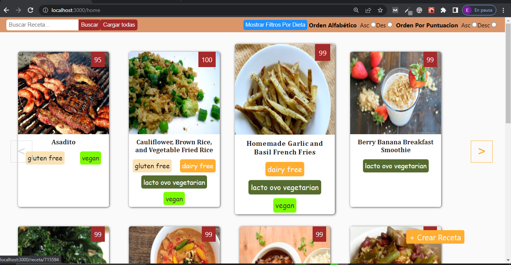
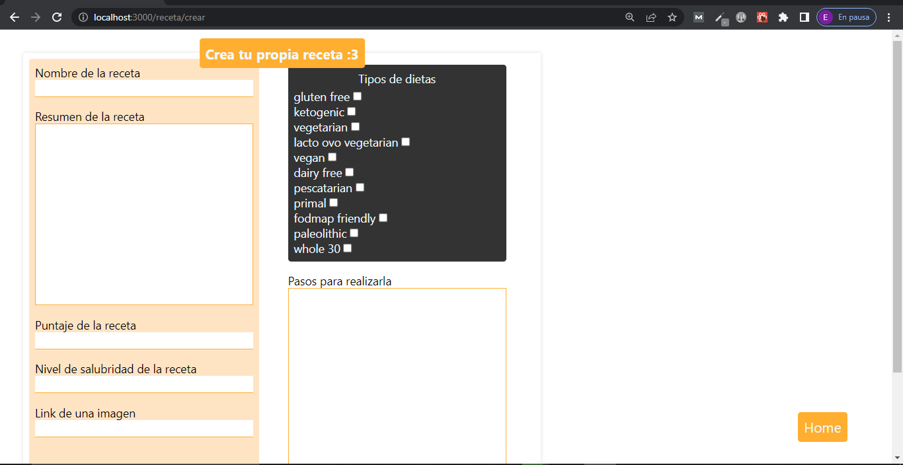

# Proyecto de Comidas

## Descripcion

Proyecto sobre una app que muestra diferentes tipos de recetas, con un puntaje
tipo de dieta (si es para veganos,libre de gluten, etc), imagen y los pasos para prepararla.
La misma puede filtrar y ordenar las recetas por orden alfabético, puntuacion y tipo de dieta.
Tambien se pueden crear nuevas recetas.

## Tecnologias que aprendí a usar

- ReactJS
- Redux
- NodeJS
- Express
- Sequelize

## Imagenes

## como probarlo(se requiere nodeJS y git)

- clonar el repositorio
- en la carpeta api, abrir un cli, ejecutar npm i y npm start
- el mismo paso anterior hacerlo en la carpeta client
